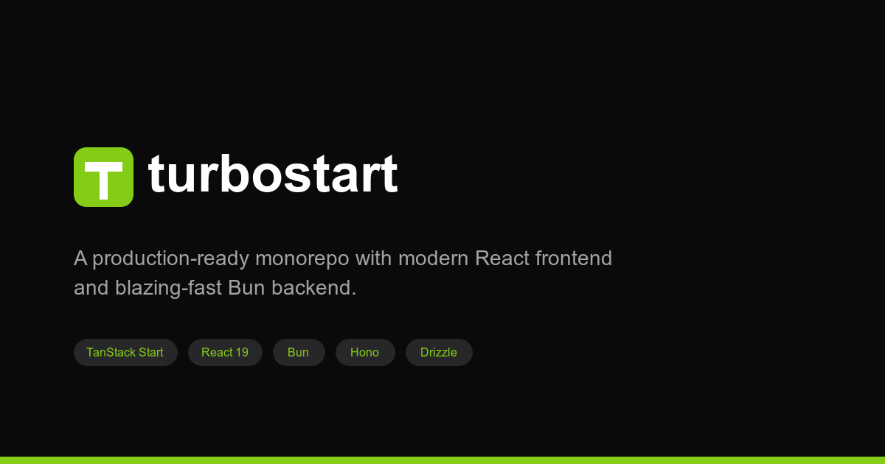

# turbostart



A production-ready monorepo with modern React frontend (TanStack Start) and blazing-fast Bun backend (Hono).

**Live Demo:** [hamedmp-turbostart-apps-frontend.hamed-mp.workers.dev](https://hamedmp-turbostart-apps-frontend.hamed-mp.workers.dev)

## Features

- **Turborepo** - Fast, incremental builds with remote caching
- **pnpm** - Fast, disk space efficient package manager
- **TypeScript** - Full type safety across all apps
- **Docker** - Development and production containers included

### Applications

| App          | Stack                     | Description                   |
| ------------ | ------------------------- | ----------------------------- |
| **Backend**  | Bun + Hono + Drizzle      | REST API with PostgreSQL      |
| **Bot**      | Grammy                    | Telegram bot framework        |
| **Frontend** | TanStack Start + React 19 | SSR web application           |
| **Video**    | Remotion                  | Programmatic video generation |

### Packages

| Package                   | Description                         |
| ------------------------- | ----------------------------------- |
| `@workspace/shared-types` | TypeScript types shared across apps |
| `@workspace/ui`           | shadcn/ui components                |

## Quick Start

```bash
# Clone the template
git clone https://github.com/HamedMP/turbostart.git my-project
cd my-project

# Install dependencies
pnpm install

# Set up environment variables
cp .env.example .env
# Edit .env with your values

# Start development
pnpm dev
```

## Documentation

- [CLAUDE.md](./CLAUDE.md) - Project overview for AI agents
- [Backend README](./apps/backend/README.md) - API documentation
- [Bot README](./apps/bot/README.md) - Bot setup guide
- [Frontend README](./apps/frontend/README.md) - Frontend development

## Project Structure

```
turbo-repo-template/
├── apps/
│   ├── backend/          # Bun + Hono API server
│   ├── bot/              # Grammy Telegram bot
│   ├── frontend/         # TanStack Start React app
│   └── video/            # Remotion video service
├── packages/
│   ├── shared-types/     # TypeScript types
│   └── ui/               # shadcn/ui components
├── .claude/              # Claude Code commands
├── .specify/             # Speckit templates
├── docker-compose.yml    # Development setup
└── docker-compose.prod.yml
```

## Development

```bash
# Start all apps in dev mode
pnpm dev

# Start only core apps (backend + frontend, no bot/video)
pnpm dev:core

# Start specific app
pnpm --filter backend dev
pnpm --filter frontend dev

# Type check all apps
pnpm typecheck

# Build all apps
pnpm build

# Build only core apps
pnpm build:core
```

### Optional Apps

The **Bot** and **Video** apps are optional. You can exclude them:

**Local development:**

```bash
# Run without bot and video
pnpm dev:core

# Or manually filter
pnpm dev --filter=!bot --filter=!video
```

**Docker (use profiles):**

```bash
# Core only (backend + frontend + postgres)
docker-compose up

# Include bot
docker-compose --profile bot up

# Include video
docker-compose --profile video up

# Include everything
docker-compose --profile full up
```

**Remove completely:** Delete `apps/bot` and/or `apps/video` folders if you don't need them.

### Database

```bash
cd apps/backend

# Generate migrations from schema changes
bun run db:generate

# Run pending migrations
bun run db:migrate

# Push schema directly (dev only)
bun run db:push

# Open Drizzle Studio (database GUI)
bun run db:studio
```

### Adding shadcn Components

```bash
cd apps/frontend
npx shadcn@latest add button
```

Components are installed to `packages/ui` and can be imported as:

```tsx
import { Button } from '@workspace/ui/components/button';
```

## Deployment

### Cloudflare Workers (Landing Page)

Deploy the frontend to Cloudflare Workers for a fast, globally distributed landing page:

```bash
cd apps/frontend

# Build for Cloudflare Workers
pnpm build:cf

# Preview locally with Wrangler
pnpm preview:cf

# Deploy to Cloudflare Workers
pnpm deploy:cf
```

### Docker (VPS / Full Stack)

For full-stack deployment with backend and database:

**Development:**

```bash
# Start all services
docker-compose up

# Start with Docker Compose watch (hot reload)
docker-compose up --watch
```

**Production:**

```bash
# Build and start production containers
docker-compose -f docker-compose.prod.yml up -d

# With Cloudflare Tunnel
docker-compose -f docker-compose.prod.yml --profile tunnel up -d
```

## Environment Variables

See [.env.example](./.env.example) for all available configuration options.

### Required

| Variable             | Description                                       |
| -------------------- | ------------------------------------------------- |
| `POSTGRES_PASSWORD`  | PostgreSQL password                               |
| `API_KEY`            | Internal API key (shared between backend and bot) |
| `TELEGRAM_BOT_TOKEN` | Telegram bot token from @BotFather                |

### Optional Integrations

| Variable             | Integration                   |
| -------------------- | ----------------------------- |
| `ANTHROPIC_API_KEY`  | Claude AI for text generation |
| `ELEVENLABS_API_KEY` | Text-to-speech                |
| `FAL_AI_KEY`         | AI image generation           |
| `R2_*`               | Cloudflare R2 storage         |
| `POSTHOG_*`          | Analytics                     |

## Type-Safe Environment Variables

This template uses [@t3-oss/env-core](https://env.t3.gg/) for runtime-validated, type-safe environment variables.

Each app has an `env.ts` file that:
- Validates environment variables at startup
- Provides full TypeScript autocomplete
- Throws descriptive errors for missing/invalid variables

```typescript
// Example: apps/backend/src/env.ts
import { createEnv } from '@t3-oss/env-core';
import { z } from 'zod';

export const env = createEnv({
  server: {
    DATABASE_URL: z.string().url(),
    API_KEY: z.string().min(1),
  },
  runtimeEnv: process.env,
});
```

## Fast Type Checking with tsgo

This template includes support for [tsgo](https://github.com/nicksrandall/tsgo-docs/blob/main/README.md) (TypeScript 7 native compiler) which provides 10-25x faster type checking.

```bash
# Fast type check with tsgo
pnpm typecheck:fast

# Traditional TypeScript check
pnpm typecheck
```

### VSCode Setup

The `.vscode/settings.json` enables experimental tsgo support:

```json
{
  "typescript.experimental.useTsgo": true
}
```

Install the recommended extensions for the best experience.

## Tech Stack References

- [Turborepo Docs](https://turbo.build/repo/docs)
- [pnpm Docs](https://pnpm.io/motivation)
- [Bun Docs](https://bun.sh/docs)
- [Hono Docs](https://hono.dev/docs)
- [Drizzle ORM Docs](https://orm.drizzle.team/docs/overview)
- [Grammy Docs](https://grammy.dev/guide)
- [TanStack Start Docs](https://tanstack.com/start/latest)
- [TanStack Router Docs](https://tanstack.com/router/latest)
- [Remotion Docs](https://www.remotion.dev/docs)
- [shadcn/ui Docs](https://ui.shadcn.com/docs)
- [t3-env Docs](https://env.t3.gg/)
- [tsgo (TypeScript Native)](https://github.com/microsoft/typescript-go)

## AI Coding Agent Setup

This template is designed to work with AI coding agents like Claude Code. The [CLAUDE.md](./CLAUDE.md) file provides comprehensive project context.

### Using with Claude Code

```bash
# Clone and open with Claude Code
claude-code my-project

# Use speckit commands for structured development
/speckit.specify Add user authentication feature
/speckit.plan
/speckit.tasks
/speckit.implement
```

## License

MIT

---

Built with the Turbo Repo Template
